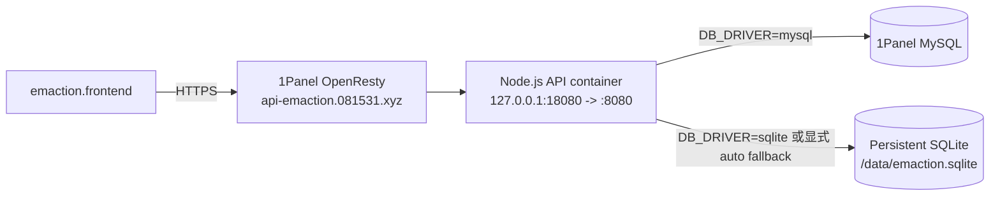

# emaction.backend 项目理解

> 本文档基于仓库静态代码、配置、README、前端调用契约和 Docker 迁移设计整理。Cloudflare Worker 部分是旧运行路径；Node.js/Docker 部分是当前部署目标。

## 项目定位

`emaction.backend` 为 `emaction.frontend` 提供匿名 reaction 聚合计数。当前部署目标是 Node.js HTTP 服务 + Docker + 1Panel OpenResty + 1Panel MySQL，可显式切换到持久化 SQLite。

业务 API 保持：

```text
GET   /reactions?targetId=...
PATCH /reaction?targetId=...&reaction_name=...&diff=...
```

新增 `GET /health` 仅供部署和监控使用。

## 前端兼容事实

前端默认 endpoint 为 `https://api.emaction.cool`，同时允许组件通过 `endpoint` 属性覆盖。本次后端目标域名为 `https://api-emaction.081531.xyz`，不修改前端；使用新服务的调用方必须显式设置新 endpoint。

前端：

- Query String 传递所有业务参数；
- 不发送 JSON body、认证信息或自定义 header；
- GET 读取 `data.reactionsGot`；
- 要求 `reaction_name` 和数字类型的 `count`；
- PATCH 只发送 `diff=1` 或 `diff=-1`；
- 通过 localStorage 记录当前浏览器是否点过，后端只保存匿名公共计数。

默认 `targetId` 是 canonical URL 去掉 hash 后的 SHA-256 小写十六进制字符串；后端把它当作不透明字符串处理。

## 运行架构



Node API 使用原生 `node:http`，数据库访问通过 `mysql2` 和 `better-sqlite3` 适配器隔离。两种适配器都使用 `(target_id, reaction_name)` 唯一约束和数据库级原子增量，避免旧 Worker 的 SELECT-UPDATE 竞态。

## 数据模型

`reactions` 表至少包含：

- `target_id`：最多 255 字符；
- `reaction_name`：最多 100 字符；
- `count`：非负整数；
- `created_at`、`updated_at`：毫秒时间戳；
- `(target_id, reaction_name)` 唯一。

schema 以 `migrations/001_create_reactions.*.sql` 为唯一事实来源，migration 使用 `npm run migrate:mysql` 或 `npm run migrate:sqlite` 手动执行。应用启动不会自动修改数据库。

## 数据库选择

- `DB_DRIVER=mysql`：生产默认，MySQL 不可用时不静默切换；
- `DB_DRIVER=sqlite`：明确使用 SQLite；
- `DB_DRIVER=auto`：仅启动阶段尝试 MySQL，失败后使用 SQLite，并通过 `/health` 标记 `degraded: true`；运行中不动态切换。

SQLite 文件必须在 Docker `/data` 持久化目录。fallback 数据不会自动合并回 MySQL。

## Docker 与发布

- 镜像：`ghcr.io/kmoretti/emaction-backend`；
- 架构：`linux/amd64`；
- 服务器目录：`/opt/emaction-backend`；
- API 只绑定 `127.0.0.1:18080`；
- MySQL 由 1Panel 独立管理，不放入项目 Compose；
- `v*` tag 触发 GitHub Actions 构建、GHCR 推送和 SSH 部署；
- `workflow_dispatch` 支持手动指定镜像 tag；
- 生产使用不可变版本 tag。

## 旧 Cloudflare 路径

`wrangler.toml` 和原 `src/worker.js` 保留作为旧 Cloudflare 部署参考，但 Docker 运行入口是 `src/server.js`。本项目不再把 D1 作为 Docker 运行时依赖，也不迁移 D1 历史数据。
